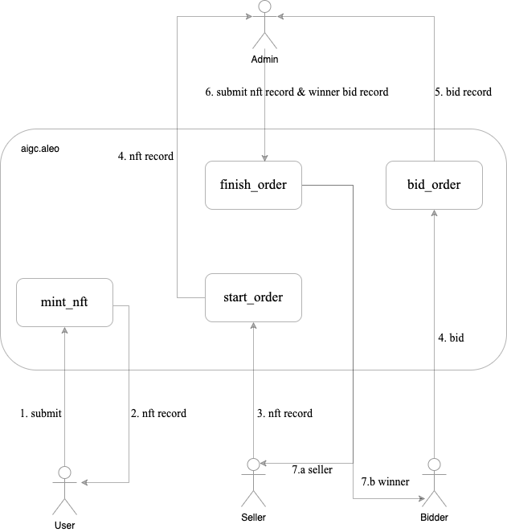

# aigc.aleo program

## Struct

```js
struct Field2 {
    first: field,   // the first half
    second: field,  // the second half
}
```

```js
struct NftHash {
    minter: address      // creator
    prompt: Field2,      // prompt command to generate image
    nonce: field,        // random number to unique nft
}
```

```js
struct NftInfo {
    holder: address, // owner address
    minter: address, // minter address
    hash: filed,     // bhp256_hash(NftHash)
    uri: Field2,     // image content ipfs url
}
```

```js
struct Order {
    holder: address, // owner address
    minter: address, // minter address
    nft_id: field,     // nft id
    order_type: u8,  // order type, 0:non-trading 1:buy now 2:make offer 3:auction（Todo）
    amount: u64,    // minumum amount
    status: u8,      // order status, 0:non-trading 1:trading 2:canceled 3:finished
    deadline: field  // the timestamp to finish order -- blocknumber or timestamp
}
```

```js
struct Bid {
    bidder: address,    // bidder address
    nft_id: field,        // id
    amount: u64,       // bidding amount
}
```

```js
struct OfferId {
    bidder: address,    // bidder address
    nft_id: field,      // id
}
```

```js
record BidRecord {
    bid_type: u8,        // 1-bid, 2-offer, 0-cancel
    owner: address,     
    bidder: address,
    nft_id: field,
    amount: field,
}
```

```js
record Nft {
    owner: address,         // NFT owner
    minter: address,        // NFT minter
    prompt: Field2,          // NFT prompt, hidden
    nonce: field             // random number to unique nft
    uri: Field2,             // NFT content
}
```

## Public states

### tokenId

mapping
Store the maximum tokenid.  
`tokenId` store: `bool => field`;

### nfts

mapping
Store all the minted nfts.  

`nfts` store: `id => NftInfo`  
`id` id++ from 1

### admin

mapping
Store admin.  
`admin` store: `bool => address`;  

### orders

mapping
Store all the orders.  
`orders` store: `field => Order`;  
key: `nft id`

### bids

mapping
Store all the bids.
`bids` store: `field => Bid`;  
key: `nft id`

### offers

mapping
Store all the offers.
`offers` store: `OfferId => Bid`;  
key: `offer id: bidder addr + nft_id`  

## Interfaces

### mint_nft

`mint_nft` used to mint nfts for aigc images
 nfts minted stored in `Nfts`

- NFT mint, permisionless。
  
inputs:

- `prompt` : Field2.private  
  nft prompt

- `uri` : Field2.public  
    image content

- `nonce` : field.public  
    random unique number

outputs:

- `NFT` record

usage:

```shell
run mint_nft:
leo run mint_nft
```

```shell
excute mint_nft:
snarkos developer execute -f $<fee> -r $<record> --query $<endpoint> --broadcast $<${endpoint}/testnet3/transaction/broadcast> -p $<private-key> $<program_id> ${function_id} $<inputs>
i.e:
snarkos developer execute 
-f 2509834 
-r "{  owner: aleo1rhgdu77hgyqd3xjj8ucu3jj9r2krwz6mnzyd80gncr5fxcwlh5rsvzp9px.private,  microcredits: 93750000000000u64.private,  _nonce: 600042304734513817307279222414740026784347330221707613918989922910747206357group.public}" 
--query "http://localhost:3030" 
--broadcast "http://localhost:3030/testnet3/transaction/broadcast" 
-p "APrivateKey1zkp8CZNn3yeCseEtxuVPbDCwSyhGW6yZKUYKfgXmcpoGPWH" 
artgo_aigc_v1.aleo 
mint_nft "{
    first: 10000field,
    second: 10000field
}" "{
    first: 10000field,
    second: 10000field
}"
```

```shell
query nft:
i.e:
curl --location 'http://127.0.0.1:3030/testnet3/program/aigc.aleo/mapping/nfts/1field'


```

### transfer_private_nft

`transfer_private_nft` used to tranfer nft.

- transfer nft, permisionless.

inputs:

- `nft_id` field  
  NFT id

- `NFT` record  
  NFT to auction

- `receiver` address  
  Minimum amount for auction

outputs:

- `NFT` record to receiver

usage:

```shell
TBD
```

### place_order

`place_order` used to start an order.

- place order, permisionless。

inputs:

- `nft_id` field  
  NFT id

- `NFT` record  
  NFT to auction

- `order_type` order type  
      0 - non-trading
      1 - normal
      2 - offer
      3 - auction

- `amount` field  
  Minimum amount for auction

- `deadline` field  
  the timestamp to finish order

- `admin_in` address  
  admin address

outputs:

- `NFT` record to admin

usage:

```shell
TBD
```

### update_order

`update_order` used to update an order.'

- update order, permisionless.

inputs:

- `nft_id` : field  
   nft id

- `new_amount` : field  
   order new amount

outputs:

usage:

```shell
TBD
```

### cancel_order

`cancel_order` used to cancel an order.'

- cancel order, permisionless.

inputs:

- `credit` : Record  
   Aleo Credit record

- `fee` : u64  
   cancel fee

- `nft_id` : field  
   nft id

- `admin_in` address  
  admin address

outputs:

- `BidRecord` record
  
usage:

```shell
TBD
```

### bid_order

`bid_order` to bid for NFT.

- bid order, permisionless.

inputs:

- `credit` : Record  
   Aleo Credit record

- `nft_id` : field  
   nft hash
  
- `amount` : field  
  bid amount

- `admin_in` address  
  admin address

outputs:

- `BidRecord` record

- success --`BidRecord` record to admin, if amount greater than previous, refund the previous. Otherwise, tx will fail.

usage:

```shell
TBD
```

### finish_order

`finish_order` to finish an order.

- finish order, only admin
- delete mapping when nft not sold.

inputs:

- `nft_id` : field  
   nft record

- `nft` : `NFT` record  
   nft record

- `fee` : u64  
   trading fee

- `winner` : address  
   winner address

- `winner_amount` : field  
   winner amount
  
- `admin_in` : address  
   admin address

outputs:

- `NFT` record to winner

usage:

```shell
TBD
```

## Make offer

### bid_offer

`bid_offer` to make an offer for NFT.

- make an offer for nft, permisionless.

inputs:

- `credit` : Record  
   Aleo Credit record

- `nft_id` : field  
   nft hash
  
- `amount` : field  
  offer amount

- `admin_in` address  
  admin address

outputs:

- `BidRecord` record
- `credit` record

- success --`BidRecord` record to admin. Otherwise, tx will fail.

usage:

```shell
TBD
```

cancel_offer
update_offer
trade_offer
finish_offer

## Workflow (TBD)



## Build Guide

To compile this Aleo program, run:

```bash
leo build
```

## Deploy Guide

To deploy this Aleo program, run:

```bash
i.e:
snarkos developer deploy 
--fee 1000001328000 
-r "{  owner: aleo1rhgdu77hgyqd3xjj8ucu3jj9r2krwz6mnzyd80gncr5fxcwlh5rsvzp9px.private,  microcredits: 93750000000000u64.private,  _nonce: 878010960996471104548362432643577968735743754584843045001751072533354535962group.public}" 
--query "http://localhost:3030" 
--broadcast "http://localhost:3030/testnet3/transaction/broadcast" 
-p ${privatekey} 
artgo_aigc_v1.aleo
```

```bash

aigc program testnet3 deployed:

v1 deployed:
txid: at1gz5azfpd0xegxxnan9j9yy0fujghvtrfdqkad0gplwf95z38s5gqfvsvp4
curl --location 'http://testnet3.artgo.app/testnet3/program/artgo_aigc_v1.aleo'

v1_1 deployed:
txid: 
at148r6xq7dadmw3a0e0afnwl303xphy4qeuhhge54283kx7tsxtgzqzcpk9a
curl --location 'http://testnet3.artgo.app/testnet3/program/artgo_aigc_v1_1.aleo'

v1_2 deployed:
txid:
at1aencztkgs0rrw7z3p4nzkcxxgxrnnfqpwv43mf34n5f02j20vqgsqh77m7
curl --location 'http://testnet3.artgo.app/testnet3/program/artgo_aigc_v1_2.aleo'

v1_3 deployed:
txid:
at10538rm2ncpazklrkqgz29fq9dwc73f9wt5hpg9r3csfjqkzc4gzs7wrtr5
curl --location 'http://testnet3.artgo.app/testnet3/program/artgo_aigc_v1_3.aleo'

mapping query:

curl --location 'http://testnet3.artgo.app/testnet3/program/${program_name}/mapping/${mapping_name}/${key}'

```
