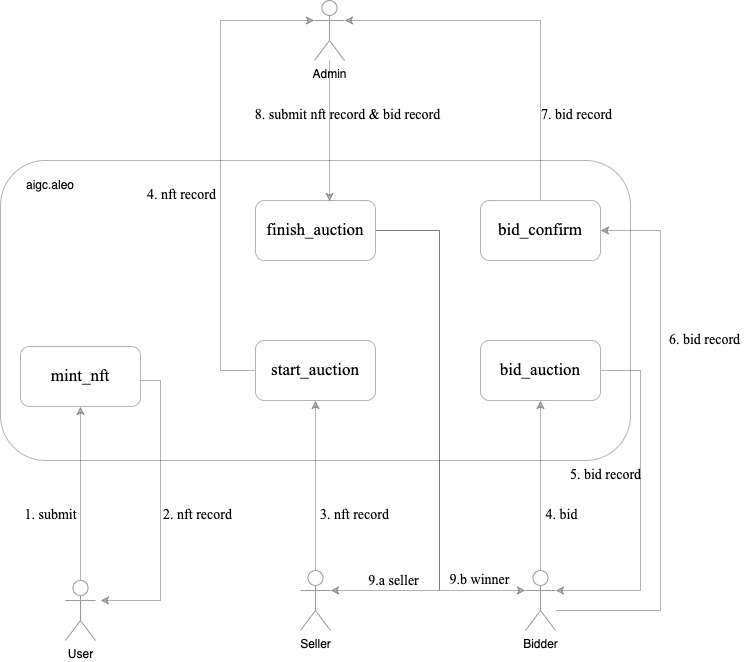

# aigc.aleo program
The combination of AIGC and NFTs can create new digital content and value. The digital content generated by AIGC can be transformed into NFT — a unique digital asset with collecting and investment value.

For project introduction, please visit : [Artgo Background](https://github.com/artgo-labs/artgo/blob/main/artgo%20background.md).

For user guide, please visit : [Artgo Tutorial](https://github.com/artgo-labs/artgo/blob/main/Artgo%20Tutorial.pdf).

Offical website : https://artgo.io/.

This documentation will introduce the program from technical side, keep updating.

## Struct

```js
struct NftHash {
    prompt: Field2,      // prompt command to generate image
}
```

```js
struct NftInfo {
    holder: address, // holder address
    hash: filed,     // bhp256_hash({prompt: field})
    uri: Field2,      // image content ipfs url
}
```

```js
struct TokenId {
    next_token_id: field,   // max nft id
}
```

```js
struct Field2 {
    first: field,   // the first half
    second: field,  // the second half
}
```

```js
record Nft {
    owner: address,         // NFT owner
    minter: address,        // NFT minter
    prompt: Field2,          // NFT prompt, hidden
    uri: Field2,              // NFT content
}
```

```js
record Bid {
    owner: address,     // bid owner
    bidder: address,    // bidder address
    nft_id: field,      // id
    gates: u64,         // bid amount
    is_winner: bool     // bid result
}
```

## Public states

### nfts

mapping
Store all the minted nfts.

`nfts` store: `id => NftInfo`  
`id` id++ from 1

### tokenId

mapping
Store the maximum tokenid.  
`tokenId` store: `bool => TokenId`;

## Interfaces

### mint_nft

`mint_nft` used to mint nfts for aigc images
 nfts minted stored in `Nfts`

- NFT mint, permisionless。
  
inputs:

- `prompt` : Field2.private
  nft prompt

- `uri` : Field2
    image content

outputs:

- `NFT` record

usage:

```shell
run mint_nft:
leo run mint_nft
```

```shell
excute mint_nft:
snarkos developer execute -f $<fee> -r $<record> --query $<endpoint> --broadcast $<${endpoint}/testnet3/transaction/broadcast> -p $<private-key> $<program_id> ${function_id} $<inputs>
i.e:
snarkos developer execute 
-f 2509834 
-r "{  owner: aleo1rhgdu77hgyqd3xjj8ucu3jj9r2krwz6mnzyd80gncr5fxcwlh5rsvzp9px.private,  microcredits: 93750000000000u64.private,  _nonce: 600042304734513817307279222414740026784347330221707613918989922910747206357group.public}" 
--query "http://localhost:3030" 
--broadcast "http://localhost:3030/testnet3/transaction/broadcast" 
-p "APrivateKey1zkp8CZNn3yeCseEtxuVPbDCwSyhGW6yZKUYKfgXmcpoGPWH" 
artgo_aigc_v1.aleo 
mint_nft "{
    first: 10000field,
    second: 10000field
}" "{
    first: 10000field,
    second: 10000field
}"
```

```shell
query nft:
i.e:
curl --location 'http://127.0.0.1:3030/testnet3/program/aigc.aleo/mapping/nfts/1field'


```

### start_auction(TBD)

`start_auction` used to start an auction.

- start auction, permisionless。

inputs:

- `NFT` record
  NFT to auction

- `amount` u128
  Minimum amount for auction

outputs:

- `NFT` record to admin

usage:

```shell
TBD
```

### bid_auction & bid_confirm (TBD)

`bid_auction` to bid for NFT.

- bid auction, permisionless 。

inputs:

- `id` : field
   nft id
  
- `bidder` : address
  bidder address

- `amount` : u64
  bid amount

outputs:

- success --`Bid` record to admin

usage:

```shell
TBD
```

### finish_auction (TBD)

`finish_auction` to finish an auction.

- finish auction, only admin

inputs:

- `nft` : `NFT` record
   nft record
  
- `winner` : `Bid` record
  bid record

outputs:

- `NFT` record to winner

- `Bid` record to seller

usage:

```shell
TBD
```

## Workflow (TBD)



## Build Guide

To compile this Aleo program, run:

```bash
leo build
```

## Deploy Guide

To deploy this Aleo program, run:

```bash
i.e:
snarkos developer deploy 
--fee 1000001328000 
-r "{  owner: aleo1rhgdu77hgyqd3xjj8ucu3jj9r2krwz6mnzyd80gncr5fxcwlh5rsvzp9px.private,  microcredits: 93750000000000u64.private,  _nonce: 878010960996471104548362432643577968735743754584843045001751072533354535962group.public}" 
--query "http://localhost:3030" 
--broadcast "http://localhost:3030/testnet3/transaction/broadcast" 
-p ${privatekey} 
artgo_aigc_v1.aleo
```

```bash

aigc program testnet3 deployed:

v1 deployed:
txid: at1gz5azfpd0xegxxnan9j9yy0fujghvtrfdqkad0gplwf95z38s5gqfvsvp4

curl --location 'http://testnet3.artgo.app/testnet3/program/artgo_aigc_v1.aleo'

mapping query:

curl --location 'http://testnet3.artgo.app/testnet3/program/artgo_aigc_v1.aleo/mapping/tokenId/true'
```
